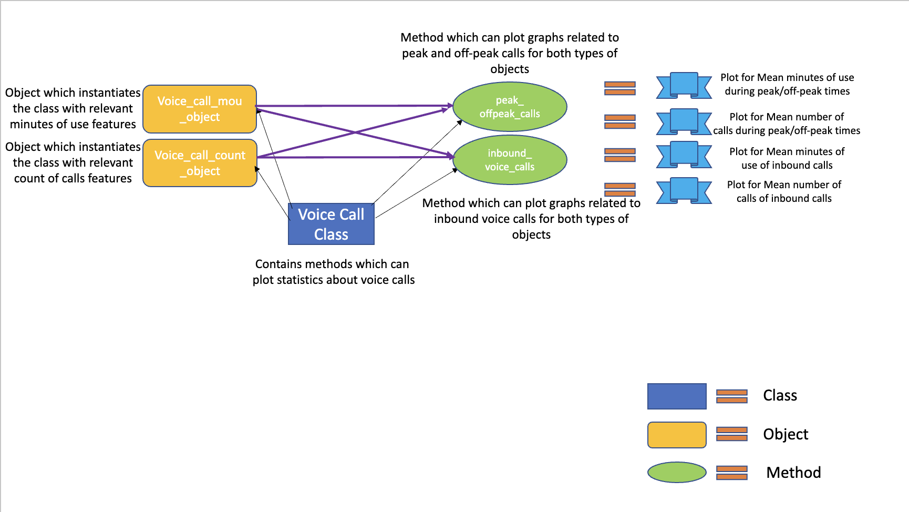
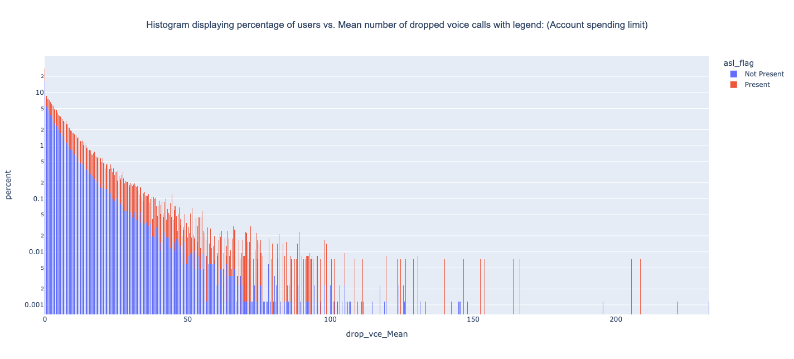
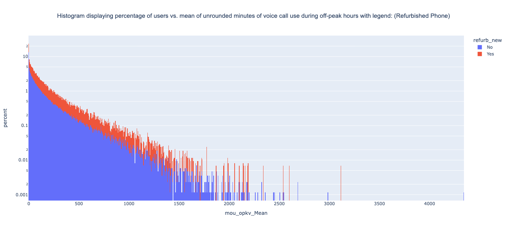

# telecommunications-data-science-project-with-oops-concept
This project analyses a large dataset containing 100 features and 100k records of telecommunications data while using Python's Object Oriented features. Object Oriented Programming is not the go-to method for any Data Analytics or Data Science project but this project attempts to use the main features of Object Oriented Programming with common data analytical and science approaches. 


### Requirements to run and test the project:

To run this project, you will need Python3+, pip and Git installed on the system. 

The reference links are provided below.

> **Python:**
  https://www.python.org/downloads/
  
> **pip:**
  https://pypi.org/project/pip/

> **Git:**
  https://git-scm.com/downloads
	
The necessary libraries and packages are specified in the **requirements.txt** file and will be validated in the below steps


## Process for acquiring the results: 

  * **Step 1:**
  Create a local directory in your machine where you want to pull the git project and clone the project by running the below command from cmd 
  (Make sure that you are in the newly created directory first!):
  
  	```git clone https://github.com/AjayTomar3342/telecommunications-data-science-project-with-oops-concept```

  * **Step 2:**
  From cmd, move into the main folder of the cloned project
  
 	 ```cd telecommunications-data-science-project-with-oops-concept```

  * **Step 3:**
  Execute the below commands to meet the pre-requisites to execute the code
  
  ```  	
      Unix/macOS
      python -m pip install -r requirements.txt

      Windows
      py -m pip install -r requirements.txt
  ```

  
  * **Step 4:**
  Execute the below commands to run the code from cmd
  
  ``` 
      Unix/macOS
      python main.py

      Windows
      %run main.py
  ```
  
  
## Alternative Process for acquiring the results(Backup):

For quick running of program, PyCharm use is suggested as it has good controls for removing manual steps to pull a repository and get it running.

Steps are:

  * **Step 1:**
  Make sure one is signed in on Github in Pycharm
  
  * **Step 2:**
  Open a new project
  
  * **Step 3:**
  Go to VCS Option on the Top Horizontal Options Bar
  
  * **Step 4:**
  Select Enable Version Control Integration Control inside VCS if not done already
  
  * **Step 5:**
  After checking the previous option on, select Checkout from Version Control and select Git
  
  * **Step 6:**
  In the new pop up window, include the link of the github repository you are trying to pull.
  Subsequently in the same pop up window, select an appropriate directory where the  project will be pulled.
  
  * **Step 7:**
  Select clone option to start the pulling process.
  
  * **Step 8:**
  Select option to start the pulled project in New Window or This window as per your personal preference.
  
  * **Step 9:**
  After this the project will be up and running and requirements.txt file will automatically install required libraries. Run the file main.py from Root Folder to get the results

This is a quick process to start the testing of GitHub project taken from the Official Jet Brains Website. We have tried this with several PC’s and are confident that this will not give any errors.

> **Link to Above Process Video:**
  https://www.youtube.com/watch?v=ukbvdF5wqPQ&feature=emb_title
  
   **NOTE:** 
This project will be regularly updated and each update will each singular/multiple modules to the project features. Each module will focus on a specific family of statistics such as Statistics for Data Calls, Statistics for Revenue earned, Statistics for Customer Care Interaction etc. 

  
  **NOTE:** 
Since, the libraries used in the project are updated by the original developers regularly, some function/functions may not run as expected. This project will be regularly updated as per the updated libraries requirement, but if project does not run at any give time when you pull the project, it may be due to the library change, rather than a coding issue. This repository is last updated as per latest libraries on 31/07/2022.


## Procedure followed in the Project:

   * **Step 1:**
   Source data for this project has been taken from this [Kaggle Webpage](https://www.kaggle.com/datasets/abhinav89/telecom-customer?resource=download). The dataset is large in relative terms as it consists of 100 features and 100k records of customers of a telecommunication company. The file is present with the name of Telcom_customer_churn.csv in data directory. 
   
   * **Step 2:**
   For each module, a class is created. Each class can have multiple number of objects where each object will focus on one kind of information(For e.g., Minutes of Use of Calls and Number of Calls). But these different objects will use the same methods inside the class as long as the usage of same method for multiple objects is practical and beneficial. Therefore, object-oriented approach of this project will make the code more organized and tightly-knit. The explanation of the workflow is also present in a visualized form in the file "documentation/Workflow_Image.png". The workflow is as follows:   
  
   * **Step 3:**
   As a result of using the class methods, various plots will be created which can be viewed in the user's browser window. The plots are interactive and therefore, comprehension will be easier for users. 
   
## Results:

For now, only visual data analytical results are present as in the upcoming updates to this project advanced statistical results will be available too.  

### Visual Results: 

Below mentioned are some results from the project: 



This plot shows proportion of users count who have witnessed dropped voice calls. Account Spending Limit adds another layer to this plot. We can clearly see that users having account spending limit witnessed more dropped calls. To find the answer as to why this is happening, more detailed data is required. 




This plot shows proportion of users count and and their mean minutes of use of voice calls during off-peak hours. Presence of refurbished or new cell phone adds another layer to this plot. It is implied from the plot that users with refurbished phones used more voice calls during off-peak hours.


